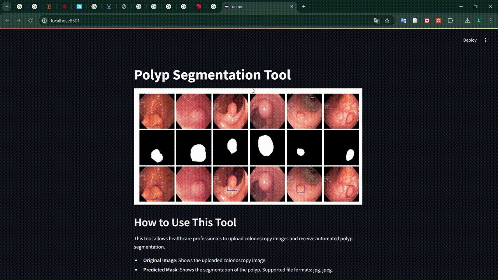
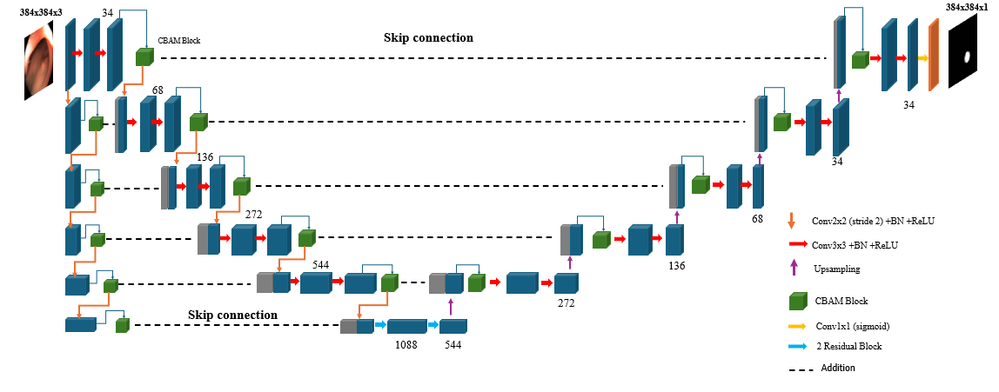
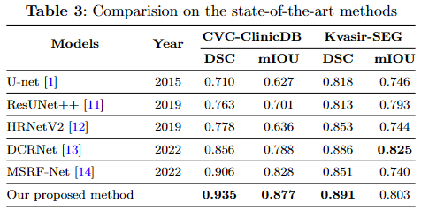
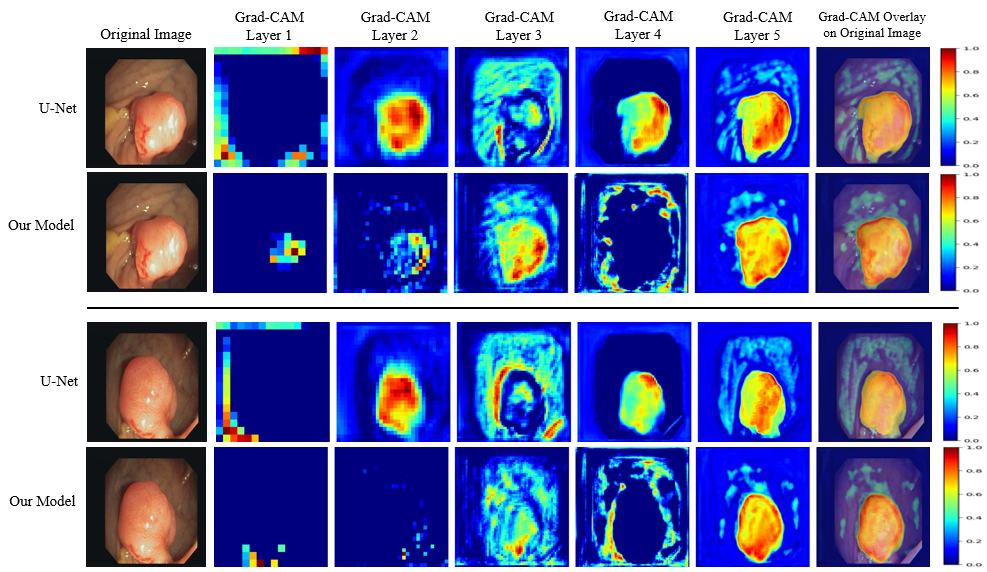

# U-Net Focus+ CBAM for Polyp Segmentation

## Introduction

U-Net Focus+ CBAM is an advanced version of the U-Net model designed to enhance the accuracy and efficiency of polyp segmentation in endoscopic images. This model integrates Focus mechanisms at multiple scales, combined with the Convolutional Block Attention Module (CBAM), to significantly improve performance over traditional U-Net models. The primary goal of this architecture is to provide more accurate diagnostic tools for clinical practice by effectively identifying and segmenting polyps in medical images. This work has been recognized at the ICIT 2024 conference.


## Features

- **Focus Mechanisms**: Employs focused convolution blocks at multiple scales to capture finer details and contextual information.
- **CBAM (Convolutional Block Attention Module)**: Enhances feature representation by focusing on the most relevant spatial and channel-wise features, improving segmentation accuracy.
- **Multi-Scale Integration**: Combines features from different layers to preserve high-resolution details and contextual information.
- **Residual Blocks**: Utilized in the bottleneck layers to allow efficient gradient flow and improve learning capability.


## Demonstration

Firstly, I introduce my demo app to help you have an overview. Here is a quick demonstration of the application in action:



## Performance

The U-Net Focus+ CBAM model has been tested on multiple datasets, including CVC-ClinicDB, Kvasir-SEG, CVC-ColonDB, and ETIS-Larib, demonstrating superior performance in terms of Dice coefficient and mean Intersection over Union (mIOU).

## Model Architecture



## Results
The model's effectiveness can be quantified through its performance on various datasets


## Visualization with Grad-CAM



## Running the Model

To train the model, simply run the training script `train.py`. Ensure that your dataset is prepared and structured correctly.

### Prerequisites
- Python
- TensorFlow
- Other dependencies listed in `requirements.txt`

### Installation

Clone the repository and install the required dependencies:

```bash
git clone https://github.com/khanhdat111/Unet-Focus-CBAM-for-Polyp-Segmentation.git
cd Unet-Focus-CBAM-for-Polyp-Segmentation
pip install -r requirements.txt
